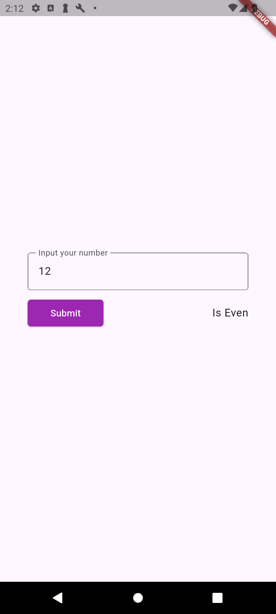
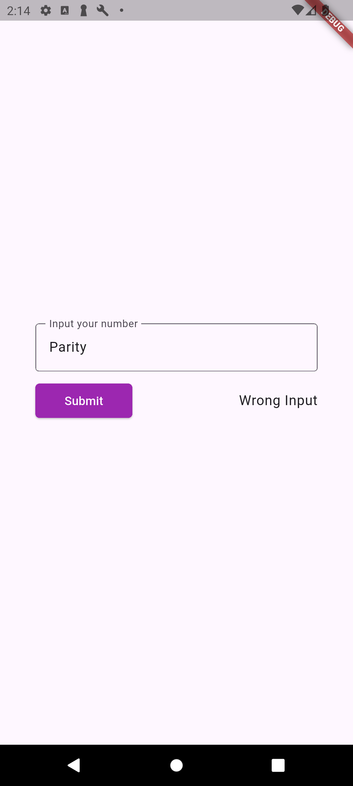

# practice_app 1(Parity App)

A simple Flutter app that lets you enter a number and instantly tells you whether it’s even, odd, or invalid.  

This project is mainly for practice and learning. It demonstrates:
- Handling user input with `TextField` and `TextEditingController`
- Updating the UI with `setState`
- Separating UI code from business logic (clean code basics)

## Screenshots

  
  

## How to run
1. Clone the repo
2. Run `flutter pub get`
3. Start the app with `flutter run`

